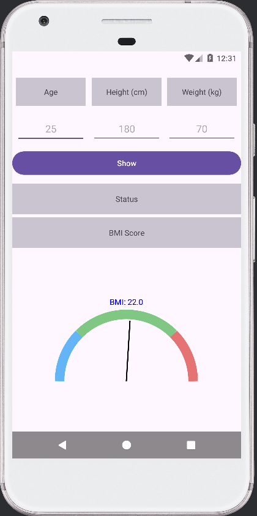
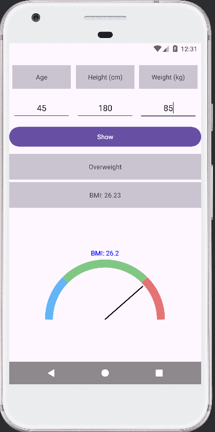
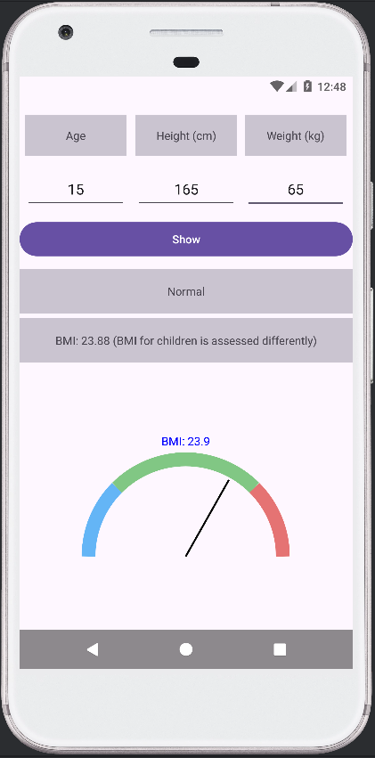

# BMI Gauge App 📱

An Android application that calculates and visualizes your **Body Mass Index (BMI)** based on your height and weight using a custom animated gauge.

## 🔍 Features

- Input fields for:
  - **Height (cm)**
  - **Weight (kg)**
  - **Age**
- Calculates and displays your BMI value.
- Custom **BMI gauge** (`BmiGaugeView`) drawn using `Canvas`.
- Visually categorized BMI results:
  - 🔵 *Underweight* (Blue)
  - 🟢 *Normal* (Green)
  - 🔴 *Overweight* (Red)
- Displays BMI score as `BMI: 22.0` above the gauge.
- Age input is included for potential future use (e.g., personalized recommendations).

## 🧠 What is BMI?

**Body Mass Index (BMI)** is a number derived from a person's weight and height. It's a simple index used to classify underweight, normal weight, and overweight individuals.

```
BMI = weight (kg) / (height (m))²
```

### BMI Categories

| Category      | BMI Range      |
|---------------|----------------|
| Underweight   | Less than 18.5 |
| Normal        | 18.5 – 24.9    |
| Overweight    | 25.0 and above |

## 🧩 Tech Stack

- **Language:** Kotlin
- **UI:** ConstraintLayout
- **Graphics:** Custom View using `Canvas`
- **Min SDK:** 21 (Android 5.0)

## 📸 Screenshots

<p float="left">
  
  
  
</p>

## 🛠 How to Build

1. Clone the repository:
   ```bash
   git clone https://github.com/YEmrehan/Android-BMI-Calculator
   ```
2. Open the project in **Android Studio**.
3. Click **Run** to build and launch the app on an emulator or physical device.

## 🗂 Project Structure

```
com.example.bmi
├── MainActivity.kt        // Main UI logic
├── BmiGaugeView.kt        // Custom View for BMI Gauge
└── res/layout/activity_main.xml
```

## 💡 Custom Gauge Logic

The `BmiGaugeView` class uses `Canvas` to draw:
- A partial circular arc with segments for different BMI ranges.
- A needle pointing to the current BMI.
- A floating text label with the BMI score.

```kotlin
canvas.drawText(bmiText, centerX, centerY - radius - 60, textPaint)
```

## 🤝 Contributions

Pull requests are welcome! If you find a bug or want to suggest a feature, feel free to open an issue.

## 📄 License

This project is licensed under the MIT License – see the [LICENSE](LICENSE) file for details.

---

Made with ❤️ using Kotlin.
